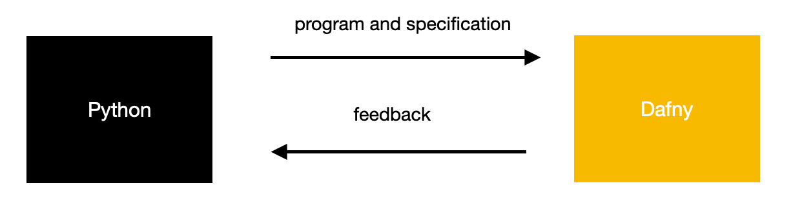

# dafny-of-python


*dafny-of-python* enables verification of Python programs. It does so by translating a program written in a [subset of typed Python](https://github.com/arsalanc-v2/dafny-of-python/wiki/Language) along with its specification, to the [Dafny](https://github.com/dafny-lang/dafny) verification language. 

Given the following function annotated with types and a specification:
```Python
# post res == x * x * x        
def cube(x: int) -> int:
  return x
```

The following Dafny function is generated:
```Dafny
function method cube(x: int): (res: int)
  ensures (res == ((x * x) * x))
{
  x
}
```

Along with the outcome of verification, where the line and column information corresponds to the original Python program:
```
verifier finished with 0 verified, 1 error(s)
Line: 2  Column: 4  Value: cube,  Error,  A postcondition might not hold on this return path.
Line: 1  Column: 11  Value: ==,  Related location,  This is the postcondition that might not hold.
```

As the specifications are written in comments, Python programs can remain executable without modification. Assuming the translation is correct, successful verification of the translated Dafny program implies that the same properties hold for the original Python program. While the aim is to prevent knowledge of Dafny from being essential, it would certainly help in understanding what *dafny-of-python* is (un)able to do. You can see [additional examples below](#examples) and find more information in the [wiki](https://github.com/arsalanc-v2/dafny-of-python/wiki).

## Usage
```
sudo dune exec src/bin/main.exe < [file].py
```
## Examples
### Type Variables and Aliases
```Python
from typing import TypeVar

T = TypeVar("T")
S = int

# reads xs
# pre idx >= 0 and len(xs) > idx
# post res == xs[idx]
def access(xs: list[T], idx: S) -> T:    
  return xs[idx]
```
### Higher Order Functions
```Python
from typing import Callable
# post res == n + 1 
def increment(n: int) -> int:
  return (n + 1)

# post res == f(x)  
def apply(f: Callable[[int], int], x: int) -> int:
  return f(x)

i = apply(increment, 3)
assert i == 4

l = lambda x : x + 1
i2 = apply(l, 3)     
assert i2 == i
```
### Linear Search
```Python
# post 0 <= res ==> res < len(xs) and xs[res] == key
# post res == -1 ==> forall k :: 0 <= k and k < len(xs) ==> xs[k] != key
def find(xs: list[int], key: int) -> int:
  index = 0
  # invariant 0 <= index and index <= len(xs)
  # invariant forall k :: 0 <= k and k < index ==> xs[k] != key
  while index < len(a):
    if xs[index] == key:
      return index
    
    index += 1
  
  return -1
```
### Binary Search
```Python
# post res <==> forall j, k :: 0 <= j and j < k and k < len(xs) ==> xs[j] <= xs[k]
def is_sorted(xs: list[int]) -> bool:
  # implementation ommitted so that the function will be treated as a predicate
  # otherwise, it cannot be used in a specification
  pass

# pre is_sorted(xs)
# post res >= 0 ==> res < len(xs) and xs[res] == key
# post res < 0 ==> forall k :: 0 <= k and k < len(xs) ==> xs[k] != key
def binarysearch(xs: list[int], key: int) -> int:
  length: int = len(xs)
  low: int = 0
  high: int = length - 1
  # decreases high - low
  # invariant length == len(xs)
  # invariant 0 <= low and high < length and low <= high + 1
  # invariant forall i :: 0 <= i and i < length and not (low <= i and i <= high) ==> xs[i] != key
  while low <= high:
    mid: int = int(low + (high - low) / 2)
    if key < xs[mid]:
      high = mid - 1
    elif key > xs[mid]:
      low = mid + 1
    else:
      return mid
  
  return -1

xs = [1, 2, 3, 4, 5]
index = binarysearch(xs, 4)
# ideally, this assertion shouldn't be required for the next assertion to be verified
assert xs[3] == 4
assert index == 3
not_index = binarysearch(xs, 6)
assert not_index < 0
```


## Status
*dafny-of-python* is currently pre-alpha software and likely to have unexpected behaviours as well as require programs to be written in an unidiomatic manner for successful verification.

## Contributing
If you find a bug or have any comments, feel free to open an [issue](https://github.com/arsalanc-v2/dafny-of-python/issues/new/choose) or pull request. 

You can find more information in the [wiki](https://github.com/arsalanc-v2/dafny-of-python/wiki).

## Credits
*dafny-of-python* was developed as part of my final year project at the National University of Singapore, with the valuable guidance of [Professor Chin Wei Ngan](https://www.comp.nus.edu.sg/cs/bio/chinwn/).

- [Nice Parser](https://github.com/smolkaj/nice-parser) is used to provide beautiful parser error messages.
- [Obelisk](https://github.com/Lelio-Brun/Obelisk) is used to pretty-print the source language grammar.
## Related Work
- [Nagini](https://github.com/marcoeilers/nagini), a static verification tool for Python using [Viper](http://viper.ethz.ch/)
- [CrossHair](https://github.com/pschanely/CrossHair), a static verification tool for Python using symbolic execution
- [H2D](http://www.doc.ic.ac.uk/~dcw/h2d.cgi), a compiler from Haskell to Dafny
- [coq-of-ocaml](https://github.com/clarus/coq-of-ocaml), a compiler from OCaml to Coq
- [goose](https://github.com/tchajed/goose), a compiler from Go to Coq

